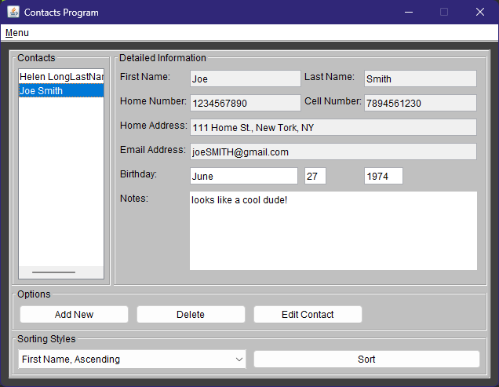

# Contacts Program

## Original Plan

Contacts Program was a Java program capable of storing the contact information of various people locally on the user's PC. The program would store information in an object called Contact, and the user would be given the ability to create, add, or remove contacts. Users would also have the option to view all saved contacts sorted by either first or last names.
 
 
There were two major limitations with this version of the project. First, the limit on the max number of contacts stored was hard-coded. This was because contact information was stored in individual text files, and having too many contacts saved would lead to an excessive amount of text files that would result in a messy directory. Second, the program had no GUI and was conducted entirely through the Command Prompt. While this isn't necessarily bad, it should be noted that not all users may find it easy to use. 

-----------------------------------------------------------------------------------------------------------------------------------------------------

## Remake

This program is a complete overhaul of one of my old Java projects. The original project was very ambitious and faced many limitations due to my inexperience with the language. Now, with a much a better understanding, I hope to create the program I originally envisioned all that time ago. This remake aims to address the aforementioned limitations in order to make the program more user-friendly and efficient. With the help of the [Jackson-jr library from FasterXML](https://github.com/FasterXML/jackson-jr), the program can now save information about all contacts into a single file in order to store data between different runs of the the program. In addition, the program features a fully functioning GUI that allows the user to view, write, or edit information. 



#### Contact Object:

 *Contact* 
 
```
{
    FirstName: String
    LastName: String
    HomeNumber: int
    CellNumber: int
    HomeAdress: String
    EmailAddress: String
    Birthday: LocalDate
    Notes: String
}

```

#### [Rough] Task Breakdown

- [x] Create Contact object class
- [x] Ability to add more Contacts 
- [x] Ability to view Contacts 
- [x] Ability to edit Contacts 
- [x] Ability to delete Contacts 
- [x] Write current Contacts into a file
- [x] Read stored Contacts from a file
- [x] Set up GUI

_This project is licensed under the Apache 2.0 license. This project relies on the specific library modules jackson-jr-objects and jackson-jr-annotation-support which are also under the Apache 2.0 license. While these libraries are not included in this repository, they are required for the program to work and are included in the uber-jar release. These libraries are used without any modification and are only used to help the program store, save, and load contact information._
